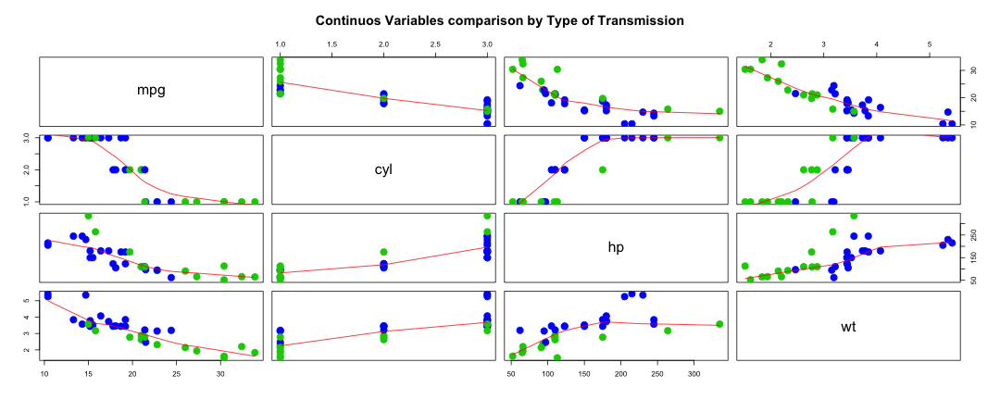
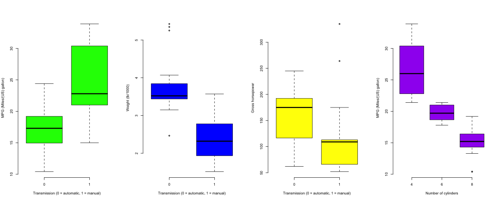
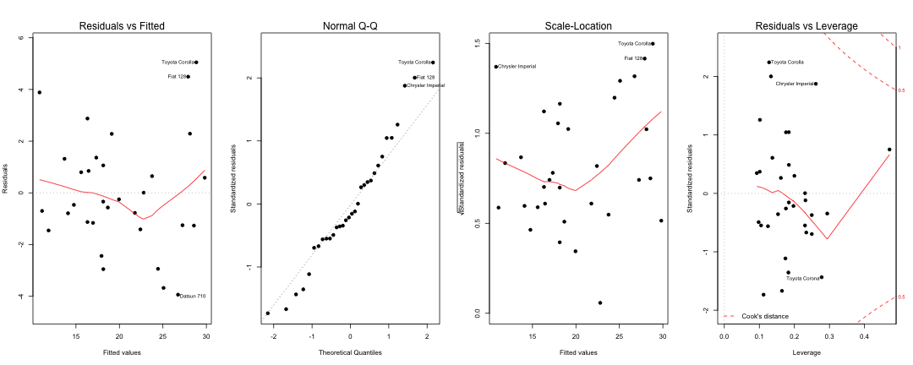
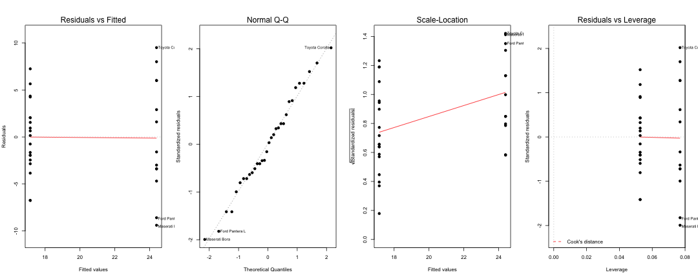

Regression Models Course Project - Week 3
==========================
Effect of The Type of Trasnmission in the MPG of a Set of Sampled Cars
=======================================================

### Executive Summary
In order to decipher the relationship between the miles per gallon efficiency we ha performed an initial exploratory analysis on the mtcars data set available in R with the purpose of examining the relationships of mpg and the type of transmission in 32 car makes. Our analysis shows that after adjustmnt the type of transmission does not present a significat difference in the type of transmission in a car after adjusnting by weight, number of cylinder and horsepower. Finally quantification of the difference between the nonadjusted and adjusted mpg differences are shown and also reflect the great difference of not taking into acccount the confounding variables in the model. 

### “Is an automatic or manual transmission better for MPG”
For this analysis the mtcars available in R was used. The data was extracted form the 1974 Motor trend magazine and is comprised of the variables: mpg (Miles/(US) gallon); cyl (Number of cylinders), disp (Displacement (cu.in.)); hp (Gross horsepower); drat (Rear axle ratio); wt (Weight (lb/1000)); qsec (1/4 mile time), vs (V/S); am (Transmission (0 = automatic, 1 = manual)); gear (Number of forward gears); carb (Number of carburetors). To be able to examine the relation between initial and preliminary exploratory data analysis (EDA) were performed (e.g. Figure 1) to define which of the variable might have or be involved or affecting the MPG and transmission relationship.

EDA give us clues about which variables could be possible counfounders for the real effect of the type of transmission. The below boxplots show the four variables which we observed could be possible defining the transmission/mpg relationship. These variables are weight, gross horsepower and number of cylinders.  


```r
data(mtcars); require(stats);require(graphics)
mtcars$cyl<-as.factor(mtcars$cyl);mtcars$am<-as.factor(mtcars$am);mtcars$gear<-as.factor(mtcars$gear);mtcars$carb<-as.factor(mtcars$carb)
pairs(mtcars[,c(1,2,4,6)],panel=panel.smooth, main="Continuos Variables comparison by Type of Transmission", col=3+(mtcars$am==0), pch=20, cex=3)
```

 

```r
par(mfrow=c(1,4))
boxplot(mpg~am,data=mtcars, col="green", xlab="Transmission (0 = automatic, 1 = manual)", ylab="MPG (Miles/(US) gallon)", frame=F)
boxplot(wt~am,data=mtcars, col="blue", xlab="Transmission (0 = automatic, 1 = manual)", ylab="Weight (lb/1000)", frame=F)
boxplot(hp~am,data=mtcars, col="yellow", xlab="Transmission (0 = automatic, 1 = manual)", ylab="Gross horsepower", frame=F)
boxplot(mpg~cyl,data=mtcars, col="purple", xlab="Number of cylinders", ylab="MPG (Miles/(US) gallon)", frame=F)
```

 

Taking into account the previously chosen variable we proposed, tested and compared the following linear models. When the linear regression just taking as outcome mpg and as predictor transmission is ran, it would appear that there is an effect of the type of transmission (see summary of the coeficients below). However, when the weight is added as a covariate to adjust for it the correlation the effect is disipated and is no longer significative (see coeeficients below). Moreover, when adding the other covariates to adjust for them still no relationship for the type of trasnmission and mpg is observed. Thus, we can say that there is not a difference in the type of transmission and the mpg for this mtcars data set. Diagnostic plots show how the better model (below) present better profiles in the plots compare to the base model (supplemental figures 1 and 2).  


```r
fitam<-lm(mpg~am,data=mtcars)
summary(fitam)$coef #base model
```

```
##             Estimate Std. Error t value  Pr(>|t|)
## (Intercept)   17.147      1.125  15.247 1.134e-15
## am1            7.245      1.764   4.106 2.850e-04
```

```r
fitamwt<-lm(mpg~am+wt,data=mtcars)
summary(fitamwt)$coef
```

```
##             Estimate Std. Error  t value  Pr(>|t|)
## (Intercept) 37.32155     3.0546 12.21799 5.843e-13
## am1         -0.02362     1.5456 -0.01528 9.879e-01
## wt          -5.35281     0.7882 -6.79081 1.867e-07
```

```r
fitamwtcylhp<-lm(mpg~am+wt+cyl+hp,data=mtcars) #better model #summary(fitamwtcylhp)$coef ##data not shown
```
### "Quantify the MPG difference between automatic and manual transmissions"
the difference between in the means of mpg for the type of transmission for the better model and for the basel model is below.

```r
fitamwtcylhp<-lm(mpg~am+wt+cyl+hp-1,data=mtcars)#;round(summary(fitamwtcylhp)$coef,3) #better model
round(as.numeric(fitamwtcylhp$coef[2]-fitamwtcylhp$coef[1]),3)
```

```
## [1] 1.809
```

```r
fitam<-lm(mpg~am,data=mtcars)#; round(summary(fitam)$coef,3) #base model 
round(as.numeric(fitam$coef[2]),3)
```

```
## [1] 7.245
```

Supplemental Figures 1 and 2
-------------------

```r
##Suplemental figures 2 and 3
par(mfrow=c(1,4))
plot(fitamwtcylhp,pch=20,cex=1.5)
```

 

```r
par(mfrow=c(1,4))
plot((fitam),pch=20,cex=1.5)
```

 
